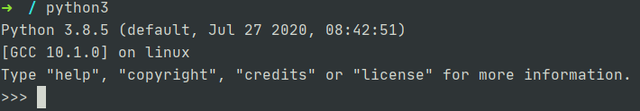

# Intro

Persiapan untuk menggunakan Python pada komputer lokal. Materi pada panduan ini ditulis dan di-_test_ menggunakan Python versi 3.8.5.

## Instalasi

Python dapat di-download dari https://www.python.org/downloads/. Pilih versi Python terbaru (panduan ini menggunakan Python 3.8.5) sesuai dengan sistem operasi yang digunakan.

Ikuti panduan berikut untuk melakukan instalasi dan setup pada masing-masing sistem operasi:
* Linux - https://docs.python.org/3/using/unix.html
* Windows - https://docs.python.org/3/using/windows.html
* Macintosh - https://docs.python.org/3/using/mac.html

Untuk memastikan Python sudah terpasang dengan baik, jalankan perintah `python` atau `python3` pada baris perintah. Jika sudah terpasang dengan baik akan ditampilkan _python shell_ seperti gambar berikut:

## Text Editor & IDE

Setelah memasang Python, _tools_ lain yang dibutuhkan adalah _text editor_ atau _Integrated Development Environment_ (IDE) untuk menulis kode program.

IDE memiliki fitur lebih lengkap dibanding _text editor_. Biasanya IDE dilengkapi dengan fitur _syntax higlighting_, _intellisense_, _debugging_, _refactoring_, dll. Sedangkan _text editor_ biasanya hanya menyediakan fitur _syntax highlighting_. IDE tentunya membutuhkan sumber daya komputer (memory, CPU dan storage) yang lebih besar dibanding _text editor_.

Beberapa IDE yang populer digunakan untuk menulis kode Python:
* PyCharm - https://www.jetbrains.com/pycharm/
* Microsoft Visual Studio - https://visualstudio.microsoft.com/
* PyDev - https://www.pydev.org/
* Komodo IDE - https://www.activestate.com/products/komodo-ide/

Beberapa _text editor_ yang populer digunakan untuk menulis kode Python:
* Atom - https://atom.io/
* Sublime Text - https://www.sublimetext.com/
* Vim - https://www.vim.org/
* Notepad++ - https://notepad-plus-plus.org/downloads/
* Geany - https://www.geany.org/
* Visual Studio Code - https://code.visualstudio.com/